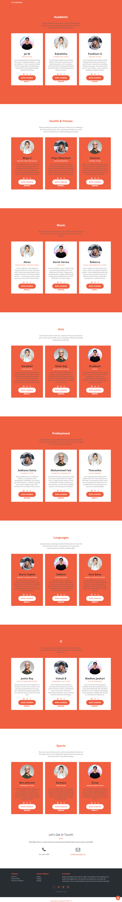

# Tutorpedia
This repository consists of HTML, CSS & JS code for a Tutor Finderr web application where you can select a tutor in a particular domain and book a session. 

# Technologies
* Bootstrap 5
* Font Awesome
* Google Fonts

# Project Link
https://barunipriyats.github.io/Tutorpedia/

# Screen Capture

